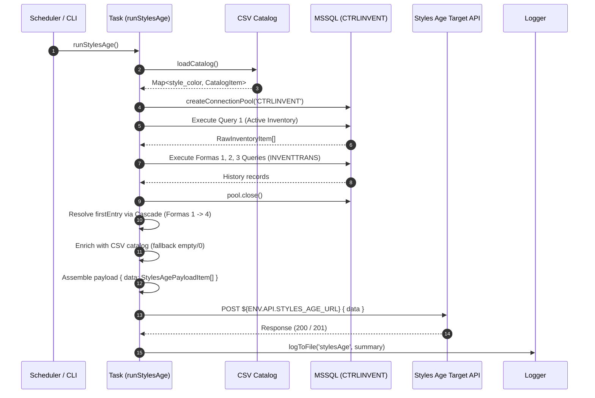

# TASK-05: Styles Age Calculation & Inventory Aging

## 1. Overview & Business Context
`stylesAge` extracts active warehouse inventory from `CTRLINVENT` (`ColeccionIntima.dbo.inventsum` and `inventdim`), determines the first warehouse entry date (`firstEntry`) for each batch/serial using a 4-step sequential fallback cascade (Forma 1 -> Forma 2 -> Forma 3 -> Forma 4), enriches records with style description, color description, and cost from a local CSV catalog, and dispatches the payload to an external API for aging categorization and reporting.

## 2. Scheduling & Execution
- **Cron Schedule**: `0 22 * * 1-5` (Every Monday to Friday at 10:00 PM)
- **Status**: `enabled: true`
- **CLI Command**: `npm run task:styles-age`
- **Direct Entry**: `tsx src/tasks/stylesAge/cli.ts`

## 3. Data Flow & Sequence Diagram


## 4. Extract Contract (Source)
- **Database Target**: `CTRLINVENT` (`10.1.1.212`)

### 4.1 Base Inventory Query (Query 1)
```sql
SELECT     
  b.inventlocationid AS ALMACEN,  
  a.itemid AS ESTILO,  
  d.Descripcion AS DESCRIPCION,  
  b.inventcolorid AS COLOR,  
  b.inventsizeid AS TALLA,  
  b.CONFIGID AS COPA,  
  b.INVENTSTYLEID AS CALIDAD,
  b.INVENTBATCHID AS LOTE,
  b.INVENTSERIALID AS SERIE,
  b.WMSLOCATIONID AS LOCALIDAD,
  sum(a.AVAILPHYSICAL) AS DISPONIBLE,  
  sum(a.ReservPhysical) AS RESERVA,  
  sum(a.PHYSICALINVENT) AS FISICO  
FROM ColeccionIntima.dbo.inventsum a   
INNER JOIN ColeccionIntima.dbo.inventdim b ON a.INVENTDIMID = b.INVENTDIMID    
LEFT JOIN cctb_ArticulosAX d ON a.ITEMID = d.Articulo  
WHERE 
  b.INVENTLOCATIONID in ('PN01', 'PN02', 'PN03','CR044')    
  AND a.PHYSICALINVENT <> 0    
  AND b.WMSLOCATIONID <> 'TALLER'    
  AND b.WMSLOCATIONID NOT LIKE 'MAQ%'    
  AND b.WMSLOCATIONID NOT LIKE 'RECIBO'    
GROUP BY
  a.itemid,
  b.inventlocationid,
  b.inventcolorid,
  b.inventsizeid,
  b.CONFIGID,
  b.INVENTSTYLEID,
  d.Descripcion,
  b.INVENTBATCHID,
  b.INVENTSERIALID,
  b.WMSLOCATIONID
HAVING sum(a.PHYSICALINVENT) > 0;
```

### 4.2 First Entry Cascade Queries (Formas 1, 2, 3)

#### Forma 1: Por Estilo y Lote (PN01 Comprado)
Aplica solo si el `LOTE` corresponde a un año numérico $\ge 2021$.
```sql
SELECT 
  a.itemid AS STYLE,
  b.INVENTBATCHID AS BATCH,
  min(a.DATEPHYSICAL) AS FIRST_ENTRY
FROM ColeccionIntima.dbo.INVENTTRANS a
INNER JOIN ColeccionIntima.dbo.INVENTDIM b ON a.INVENTDIMID = b.INVENTDIMID
INNER JOIN ColeccionIntima.dbo.inventTransOrigin c ON a.INVENTTRANSORIGIN = c.RECID
WHERE a.STATUSRECEIPT IN ('1')
  AND c.REFERENCECATEGORY IN ('2', '3')
  AND b.INVENTLOCATIONID IN ('PN01')
GROUP BY 
  a.itemid,
  b.INVENTBATCHID,
  c.REFERENCECATEGORY;
```

#### Forma 2: Por Lote Únicamente
Aplica a los registros pendientes que no obtuvieron fecha en Forma 1.
```sql
SELECT 
  b.INVENTBATCHID AS BATCH,
  min(a.DATEPHYSICAL) AS FIRST_ENTRY
FROM ColeccionIntima.dbo.INVENTTRANS a 
INNER JOIN ColeccionIntima.dbo.INVENTDIM b ON a.INVENTDIMID = b.INVENTDIMID
INNER JOIN ColeccionIntima.dbo.inventTransOrigin c ON a.INVENTTRANSORIGIN = c.RECID
WHERE a.STATUSRECEIPT IN ('1')
  AND c.REFERENCECATEGORY IN ('2', '3')
  AND b.INVENTLOCATIONID IN ('PN01')
GROUP BY 
  b.INVENTBATCHID, 
  c.REFERENCECATEGORY;
```

#### Forma 3: Por Estilo Únicamente
Aplica a los registros pendientes que no obtuvieron fecha en Formas 1 y 2.
```sql
SELECT 
  a.itemid AS STYLE,
  b.INVENTBATCHID AS BATCH,
  min(a.DATEPHYSICAL) AS FIRST_ENTRY
FROM ColeccionIntima.dbo.INVENTTRANS a 
INNER JOIN ColeccionIntima.dbo.INVENTDIM b ON a.INVENTDIMID = b.INVENTDIMID
INNER JOIN ColeccionIntima.dbo.inventTransOrigin c ON a.INVENTTRANSORIGIN = c.RECID
WHERE a.STATUSRECEIPT IN ('1')
GROUP BY 
  b.INVENTBATCHID, 
  c.REFERENCECATEGORY, 
  a.itemid;
```

#### Forma 4: Fallback por Defecto
Cualquier registro que permanezca sin fecha recibe la fecha actual del sistema (`new Date()`).

---

## 5. Transform Contract (In-Memory Processing)
1. **Resolución de Cascada**:
   - Cada fila de inventario se evalúa en orden Forma 1 -> Forma 2 -> Forma 3 -> Forma 4 hasta obtener `firstEntry`.
   - Formatear `firstEntry` en formato `YYYY-MM-DD`.
2. **Carga y Enriquecimiento de Catálogo CSV**:
   - Archivo: `src/tasks/stylesAge/data/styles-catalog.csv` (ignorado en Git).
   - Encabezados: `estilo, color, costo, descripcion, des color`.
   - Índice en memoria: `${estilo.toLowerCase().trim()}_${color.toLowerCase().trim()}`.
   - En caso de no existir la tupla `(estilo, color)` en el CSV:
     - `description`: `""`
     - `colorDescription`: `""`
     - `cost`: `0`
3. **Mapeo de Campos**:
   - `style`: `item.ESTILO`
   - `description`: Catálogo CSV (`descripcion`) || `""`
   - `availableInventory`: `item.DISPONIBLE`
   - `reservedInventory`: `item.RESERVA`
   - `warehouseId`: `item.ALMACEN`
   - `color`: `item.COLOR`
   - `colorDescription`: Catálogo CSV (`des color`) || `""`
   - `size`: `item.TALLA`
   - `cup`: `item.COPA ?? ""`
   - `productQuality`: `item.CALIDAD ?? ""`
   - `productSerialNumber`: `item.SERIE ?? ""`
   - `locality`: `item.LOCALIDAD ?? ""`
   - `batchId`: `item.LOTE ?? ""`
   - `firstEntry`: `YYYY-MM-DD`
   - `cost`: Catálogo CSV (`costo`) || `0`

---

## 6. Load Contract (Target API)
- **Method & Endpoint**: `POST ${ENV.API.STYLES_AGE_URL}` (Default: `http://localhost:3000/api/inventory/styles-age`)
- **Headers**:
  - `Content-Type: application/json`
  - `x-api-token: ${ENV.API.STYLES_AGE_TOKEN}`
- **Payload Schema**:
```json
{
  "data": [
    {
      "style": "110997",
      "description": "BOXER CABALLERO",
      "availableInventory": 0,
      "reservedInventory": 176,
      "warehouseId": "PN02",
      "color": "280",
      "colorDescription": "MARINO",
      "size": "14",
      "cup": "",
      "productQuality": "ALTA",
      "productSerialNumber": "A00387530",
      "locality": "A-01-01",
      "batchId": "TM186",
      "firstEntry": "2023-01-20",
      "cost": 45.50
    }
  ]
}
```

---

## 7. Failure Invariants & Resilience
- El pool de conexión de base de datos **debe cerrarse siempre** en el bloque `finally`.
- Si el archivo CSV no existe o está vacío al ejecutarse la tarea, no debe fallar el proceso entero: se emitirá un log de advertencia (`logger.warn`) y se aplicarán los valores por defecto (`""`, `0`) para todos los registros.
- Errores de red al enviar a la API se registran en `logs/stylesAge.log` preservando el mensaje y código HTTP de Axios.

---

## 8. Verification & Auditing
- Health check: `npm run spec:verify`
- Compilación: `npm run build`
- Ejecución CLI: `npm run task:styles-age`
- Auditoría de logs: `logs/stylesAge.log`
